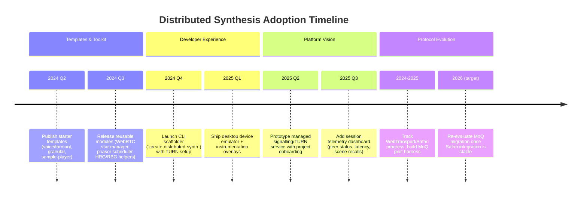
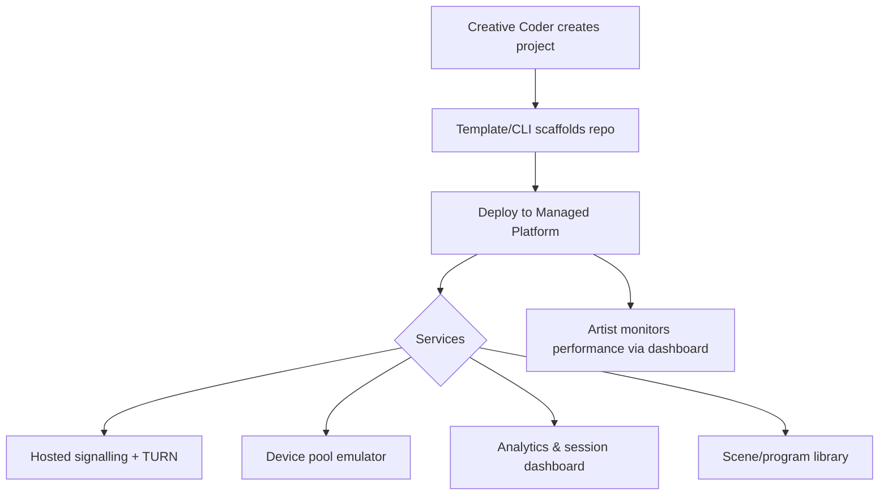

# Distributed Synthesis Roadmap

This roadmap captures the staged plan for making the Voice.Assembly.FM
architecture more accessible to creative coders and sonic artists while
preparing for future protocol evolution from WebRTC to Media over QUIC (MoQ).

## Strategic Pillars

1. **Templates & Toolkit** – Provide drop-in starting points and reusable
   modules so new projects can exist within minutes.
2. **Developer Experience Enhancements** – Improve local iteration, testing, and
   integration with familiar creative environments.
3. **Managed Platform Vision** – Lay the groundwork for a hosted deployment
   surface tuned for distributed synthesis ensembles.
4. **Protocol Evolution Watch (WebRTC → MoQ)** – Continue operating on
   battle-tested WebRTC while monitoring MoQ maturity and Apple Safari support.

## Timeline

## Near-Term Initiatives (Templates & Toolkit)

- **Starter Repositories**
  - Voice/formant ensemble (current DSP).
  - Granular sampler ensemble with shared timing.
  - Sample replayer / percussive grid with HRG-backed pitch selection.
- **Module Library**
  - WebRTC star manager (signalling + SFU-compatible client helper).
  - Phasor scheduler + envelope runtime (shared with synth clients).
  - HRG/RBG utilities with NSG/DSG nomenclature and validation helpers.
- **Cookbook Documentation**
  - Recipes for adding parameters, wiring ranges, batching sub-parameter edits,
    managing scenes, etc.

## Developer Experience Enhancements

- **CLI Scaffolder**
  - Choose DSP template, pre-populate TURN credentials, optionally generate
    HTTPS dev tunnel.
- **Device Emulator**
  - Simulate multiple synth clients inside a desktop app for quick iteration
    without dozens of phones.
- **Integration Guides**
  - Short walkthroughs for Max/MSP, SuperCollider, TouchDesigner, Unity, showing
    how to bridge into the WebRTC control plane.

## Managed Platform Vision

Key capabilities to develop once templates gain adoption:

- Hosted signalling and TURN with simple API keys.
- Project onboarding (link GitHub repo, auto-build, configure SSL).
- Session analytics (connected peers, latency, jitter, parameter change rates).
- Recording and replay of control data for post-performance analysis.
- Community scene/preset exchange.

## Protocol Evolution: WebRTC to Media over QUIC (MoQ)

**Current Position (WebRTC):**

- Mature, universally supported (Chrome, Firefox, Edge, Safari).
- Requires WebRTC SFU to achieve hub-and-spoke distribution.
- Complex signalling (SDP, ICE) but proven for co-located events.

**MoQ Advantages (Future):**

- Native publish-subscribe model via QUIC relays.
- Eliminates SDP/ICE handshake; faster connection setup via WebTransport.
- Modern Streams/PROMISE-based APIs and worker compatibility.

**Blocking Factors:**

- WebTransport absent on Safari (macOS/iOS), preventing audience reach on
  iPhones.
- Maintaining WebSocket fallback would negate simplicity gains.

**Action Items:**

1. Maintain WebRTC + SFU architecture for production deployments.
2. Build a small MoQ pilot harness (controller + synth) behind feature flag once
   Chrome/Firefox support stabilises.
3. Monitor Safari/WebTransport roadmap and W3C/WebTransport WG updates.
4. Reassess migration once Safari ships stable WebTransport, ideally targeting
   2026 for decision checkpoint.

## Decision Log & Checkpoints

| Date (target) | Focus             | Decision Gate                                                                 |
| ------------- | ----------------- | ----------------------------------------------------------------------------- |
| 2024 Q2       | Templates live    | Are artists able to fork & deploy ensembles within 1 hour?                    |
| 2024 Q4       | CLI + Emulator    | Does local iteration feel “playable” for non-WebRTC experts?                  |
| 2025 Q2       | Managed prototype | Validate hosted signalling + analytics with pilot artists.                    |
| 2026          | MoQ revisit       | Safari WebTransport GA? If yes, plan phased migration; if no, stay on WebRTC. |

---

This roadmap should be revisited quarterly as community feedback, browser
support, and platform capabilities evolve.
