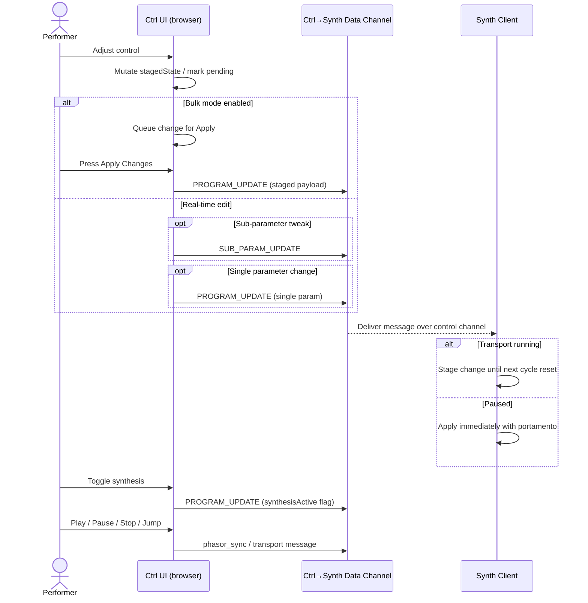
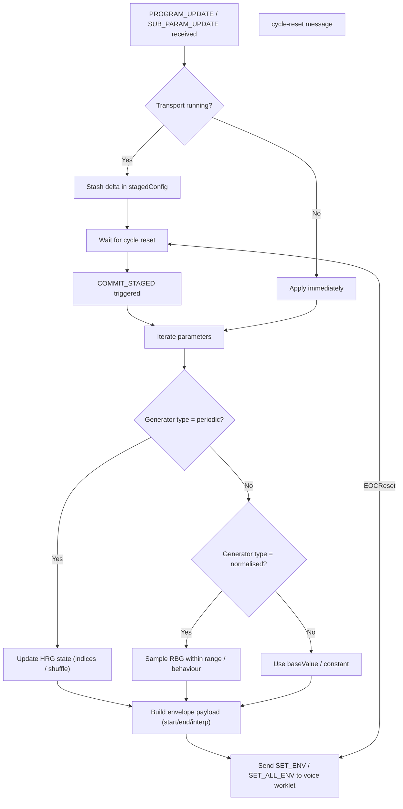

# Voice.Assembly.FM System Specification

## Overview

Voice.Assembly.FM is a distributed vocal synthesis platform that transforms
audience members' phones into components of a collective choir. The system is
designed around tight synchronisation between a Eurorack rig (via the Expert
Sleepers ES-8) and WebRTC-connected mobile devices, using sophisticated
formant/zing synthesis to create harmonically-related vocal textures that sum
acoustically in the performance space.

**Core Concept**: The performer steers harmonic and temporal parameters from a
browser-based control surface that also acts as the ES-8 bridge, ensuring the
Eurorack patch and the distributed phone ensemble share a coherent transport and
harmonic program. While the current build mirrors its software phasor out to the
ES-8, the system roadmap keeps hardware synchronisation as a first-class target,
with 12-24 audience phones generating stochastic harmonic variations that align
with the Eurorack timing domain.

## System Architecture

### High-Level Components

1. **Ctrl Client** (Performer's browser)
   - WebRTC master for network coordination
   - Parameter broadcast and timing control
   - ES-8 CV I/O path (current release mirrors phasor/clock; next milestone adds
     1V/oct sequencing and hardware timing capture)
   - Planned Monome Grid support for tactile HRG editing

2. **Synth Clients** (Audience phones)
   - Minimal UI: gesture to enable audio + XY oscilloscope
   - Formant/zing synthesis engine
   - WebRTC slave for timing synchronization
   - Local speaker output for acoustic summing

3. **Signaling Server** (WebSocket)
   - Peer discovery and WebRTC connection setup
   - No audio routing - pure coordination

## ES-8 Integration (Current Status & Roadmap)

### Current Support

The ES-8 bridge is a core pillar of the architecture. The present release boots
an `es8-processor` AudioWorklet that mirrors the software phasor so the Eurorack
patch can already receive cycle and clock information while we finish inbound
timing capture and pitch CV sequencing. Channel mapping today:

- **Channel 5**: Step clock pulse (gate high for first half of each step).
- **Channel 6**: Normalized phasor CV (0-1 ramp) suitable for scope or
  downstream modulation.
- **Channel 7**: End-of-cycle trigger pulse. Channels 0-4 remain silent
  placeholders; the forthcoming 1V/oct and gate lanes will occupy these outputs.
  Timing is currently software-driven, but the ES-8 signals already serve as the
  synchronisation hook for the Eurorack patch. Hardware feedback will promote
  the ES-8 ramp to transport authority once implemented.

### Roadmap

- **1V/oct CV sequencing**: Port the `reference/es_8_test` approach so the
  controller can drive pitch CV and triggers directly from the HRG system.
- **CV input feedback**: Reintroduce ES-8 ramps/clock inputs to allow hardware
  to become the transport authority when connected.
- **Expanded gate mapping**: Fill the remaining channels with configurable
  trigger/CV lanes once the above pieces land.

### Cycle Control

- **Duration**: ~2 seconds typical (~120 BPM in 4/4), adjustable from the ctrl
  UI.
- **Control**: Period and subdivision settings are changed in the browser; ES-8
  reacts to those values when enabled.
- **Timing Source**: Controller phasor broadcast (mirrored to the ES-8). Once
  inbound timing capture ships, the ES-8 ramp will be able to drive the network
  transport.

## Network Architecture

### Topology

- **Physical**: Star topology WebRTC network (ctrl-hub, synth-spokes)
- **Logical**: Ctrl-master, synth-slave timing hierarchy
- **Capacity**: Designed for 12-24 concurrent synth clients
- **Auto-Connect**: Both clients connect automatically on page load

### Master-Slave Coordination

- **Leadership**: Ctrl clients are always masters/leaders (no election needed)
- **Sync Protocol**: Continuous ping-pong timestamp exchange
- **Phasor Synchronization**: Distributed phase coherence for musical timing
- **Connection Flow**: Network connects immediately, audio requires user gesture

### WebRTC Configuration

```js
// Dedicated sync channel (unreliable, unordered)
const syncChannelOptions = {
  ordered: false,
  maxRetransmits: 0,
};
```

## Synthesis Engine

### Core Engine

Based on morphing-zing synthesis from euclidean sequencer reference:

- **Formant synthesis**: Three-formant vowel generation with vowel space
  morphing
- **Zing synthesis**: Ring modulation + phase modulation with hard sync
- **Hybrid modes**: Continuous blend between formant and zing

### Synthesis Parameters

The current control surface exposes the following parameters. Each parameter
stores a `baseValue`, an interpolation mode, and generator definitions that are
resolved on the synth clients.

**Periodic generator parameters (`GeneratorConfig.type = "periodic"`):**

- `frequency` – Fundamental frequency resolved from harmonic ratios.
- `vibratoRate` – Optional; can use HRG-style ratios when deeper modulation is
  needed, but defaults to bounded random ranges.

**Normalized parameters (`GeneratorConfig.type = "normalised"`):**

- `vowelX`, `vowelY` – 2D vowel position controlling the formant targets.
- `zingAmount`, `zingMorph`, `symmetry` – Spectral shaping controls for the
  zing/formant blend.
- `amplitude`, `whiteNoise` – Level controls (often left static during
  performance, but still expressed through the unified generator format).
- `vibratoWidth` – Depth of vibrato modulation.

`synthesisActive` and other transport flags remain top-level fields in the
network protocol rather than envelope-driven parameters.

_See "Parameter Randomization Systems" below for how the periodic and normalized
generators behave._

### Formant Frequency Constraints

All secondary oscillator ratios (for both formant and zing modes) are
constrained to vowel-realistic frequency ranges:

- **F1 range**: ~240-850 Hz (ratios ~1.1-3.9 relative to fundamental)
- **F2 range**: ~596-2290 Hz (ratios ~2.7-10.4)
- **F3 range**: ~2240-3010 Hz (ratios ~10.2-13.7)

This ensures all synthesis modes produce human voice-like spectral content.

## Parameter Randomization Systems

Voice.Assembly.FM resolves parameter values with **two generator types** that
map directly to the runtime implementation:

### 1. Periodic (HRG) Generators

- **Purpose**: Produce discrete harmonic ratios via paired numerator and
  denominator sequence generators (each defined by SIN strings and temporal
  behaviours).
- **Usage**: `frequency` always uses periodic generators; `vibratoRate` can opt
  into HRG behavior when required.
- **Example**: `numerators: "1-3"`, `denominators: "1-2"` with
  `behavior:
  "shuffle"` yields cycle-to-cycle ratios like 1/1, 2/1, 3/2, etc.,
  shared with synths as compact SIN definitions.

### 2. Normalised (Range-Based) Generators

- **Purpose**: Provide bounded random values using `range` definitions and
  sequence behaviors (`static` or `random`). Values are not limited to [0,1];
  the controller can specify any meaningful numeric span.
- **Usage**: Vowel positioning, zing controls, amplitude, white noise, and
  vibrato width all use `type: "normalised"` generators.
- **Example**: `vowelX.startValue.range = { min: 0.2, max: 0.4 }` and
  `.endValue.range = { min: 0.6, max: 0.8 }` randomize each synth within those
  bounds.

### Why Two Systems?

- Harmonic parameters require discrete ratios to keep the ensemble in tune.
- Continuous controls benefit from smooth exploration inside safe ranges.
- Transmitting generator definitions keeps bandwidth low while letting each
  synth resolve values independently at end-of-cycle (EOC) events.

### Minimal Computation Principle

- **Controller as dispatcher**: The ctrl client avoids heavy stochastic
  resolution work, broadcasting only the generator deltas that arise from user
  edits.
- **Synth-side resolution**: Each synth resolves its NSG/DSG and normalised
  generators locally at EOC, ensuring per-device uniqueness without controller
  recomputation.
- **Sub-parameter messaging**: Fine-grained updates (e.g., tweaking an NSG SIN
  string or a base value) use `sub-param-update` messages so only the affected
  generator is recalculated, keeping bandwidth and CPU usage minimal while
  preserving deterministic staging semantics.

## Harmonic Ratio Generator (HRG) System

### Concept

HRGs provide stochastic variation of frequency parameters across the distributed
choir using Stochastic Integer Notation (SIN).

### Nomenclature

- **HRG**: A complete harmonic ratio generator attached to a parameter position
  (e.g., frequency start). It resolves a rational value by combining two
  sub-generators:
  - **Numerator Sequence Generator (NSG)**: The integer sequence drawn from the
    numerator SIN definition plus its temporal behaviour.
  - **Denominator Sequence Generator (DSG)**: The matching integer sequence
    drawn from the denominator SIN definition and behaviour.
- Each HRG is therefore expressed as `{ NSG, DSG }`, and every parameter that
  supports HRGs carries two instances: a start HRG and (for `disc`/`cont`
  interpolation) an end HRG.

### SIN Format

- **Notation**: "1-3, 4, 7-9" → [1, 2, 3, 4, 7, 8, 9]
- **Behaviors**: static, ascending, descending, shuffle, random (non-repeating)

### HRG Parameters

- **Frequency Start HRG**: `NSG_start` + `DSG_start`
- **Frequency End HRG**: `NSG_end` + `DSG_end`
- **Total**: Four sequence generators per parameter (two numerators, two
  denominators)

### Resolution Architecture

**Ctrl-side resolution** (not synth-side):

- Ctrl maintains `synthId → assignedRatio` mapping
- Ensures musical harmonic distributions (no clustering)
- Enables visualization and live reassignment
- Lower bandwidth (specific values vs full HRG sets)

### Implementation Status ✅ COMPLETED for Frequency

**User Interface**:

- **[H] Toggle Button**: Compact design replaces dice emoji
- **Two-line Layout**: Numerators (n:) and denominators (d:) on separate lines
  to expose the NSG/DSG pair directly
- **Separate Behaviors**: Independent behavior selection for numerators and
  denominators
- **Deferred Application**: Changes require "Apply Changes" button (no Range/HRG
  mode selector)

**Temporal Behaviors**:

- **Static (S)**: Random start, constant value
- **Ascending (A)**: Random start, increments at EOC
- **Descending (D)**: Random start, decrements at EOC
- **Shuffle (Sh)**: Fixed random sequence
- **Random (R)**: Non-repeating selection

**Integration**: HRG values applied at phasor cycle boundaries (EOC) with
envelope system integration.

**Scene Memory**: HRG state (indices and shuffle orders) preserved in per-synth
scene memory system for performance recall.

## Parameter Envelope System

### Per-Parameter Configuration

Each synthesis parameter stores:

- **Interpolation**: `"step"`, `"disc"`, or `"cont"`.
  - `step` holds a single resolved value for the whole cycle.
  - `disc` performs a cosine glide between start and end values each cycle.
  - `cont` reuses the previous end value as the next start for seamless motion.
- **Start/End Generators**: `startValueGenerator` always exists; an
  `endValueGenerator` is required when interpolation is `disc` or `cont`.
- **Base Value**: Handy reference for direct numeric edits and for periodic
  generators that need an anchor frequency in Hz.

**Randomization Integration**:

- Periodic generators use SIN strings and behaviors to resolve ratios at EOC.
- Normalised generators pick values within configured ranges; when interpolation
  is `step` the end generator can be omitted.

### Timing

- **Duration**: One controller phasor cycle. The phasor is mirrored to the ES-8
  so Eurorack gear can already follow along; upcoming hardware capture will let
  the ES-8 ramp become the authoritative transport reference.
- **Progress**: Synth phasor worklet provides normalized 0-1 phase for envelope
  evaluation.

## Scene Memory System

### Architecture

**Distributed Storage Model**:

- **Controller**: Saves program configuration in localStorage (UI state)
- **Synths**: Each maintains independent 10-slot in-memory scene array
- **No synchronization**: Each synth client operates autonomously
- **Ephemeral**: Scene memory lost on page refresh (intentional design)

### Per-Synth State Capture

**Saved State per Synth**:

```js
sceneSnapshots[bank] = {
  snapshot: {
    amplitude: 0.8, // Direct parameter values
    whiteNoise: 0.0, // RBG stat mode values
    // ... other direct/stat parameters
  },
  sequences: {
    frequency: {
      numeratorBehavior: "static",
      denominatorBehavior: "static",
      indexN: 4, // NSG position
      indexD: 1, // DSG position
      orderN: null, // NSG shuffle order (if shuffle behaviour)
      orderD: null, // DSG shuffle order (if shuffle behaviour)
    },
    // ... other HRG parameters
  },
};
```

### Save/Load Process

**Save Operation** (per synth):

1. **Capture HRG state**: Current indices and shuffle orders for all HRG
   parameters
2. **Capture direct values**: Current amplitude, white noise, and RBG stat
   values
3. **Store in memory**: Save to `sceneSnapshots[bank]` array
4. **No coordination**: Each synth saves independently

**Program vs Scene**:

- **Program**: Shared unresolved control state transmitted from the ctrl client
  (interpolations, NSG/DSG definitions, normalized ranges).
- **Scene**: Per-synth resolved snapshot (current AudioParam values + HRG
  positions) captured locally for recall.

**Load Operation** (per synth):

1. **Check local memory**: Look for saved state in `sceneSnapshots[bank]`
2. **Restore HRG state**: If saved sequences exist, restore exact indices and
   orders
3. **Apply direct values**: Restore saved amplitude, white noise, etc.
4. **Fresh initialization**: If no saved state, initialize new random state
5. **Preserve program config**: Don't overwrite program if we have saved state

### Re-resolve Functionality

**Purpose**: Generate new ensemble textures during performance

**Process**:

1. **Controller broadcasts**: `RERESOLVE_AT_EOC` message to all synths
2. **Synth flags**: Each synth sets `reresolveAtNextEOC = true`
3. **EOC trigger**: At next End-of-Cycle, each synth randomizes static HRG
   indices
4. **Per-synth randomization**: Each synth generates unique new indices
5. **Immediate effect**: New frequencies take effect at the next cycle

### Benefits

**Eliminates Complexity**:

- No synth ID management or conflicts
- No localStorage coordination between tabs
- No network synchronization required

**Preserves Musical Intent**:

- Each synth maintains its unique scene state
- Saved scenes restore exact ensemble textures
- Re-resolve provides controlled randomization

**Performance Optimized**:

- Instant scene transitions (no network delay)
- Minimal memory footprint
- No persistent storage complexity

### Aural Feedback Paradigm

- **Controller intentionally blind**: The ctrl client does not pull resolved
  per-synth values; it only knows the shared program definition and aggregate
  peer status.
- **Synth-side authorship**: Each handset resolves its generators, stores scene
  snapshots, and recalls them locally without confirmation from the controller.
- **Performance practice**: The performer listens to the acoustic summation in
  the room and responds by adjusting the shared program rather than
  micromanaging individual devices.
- **Design implication**: Network bandwidth stays minimal and the system
  tolerates device churn without re-synchronising every resolved value through
  the controller.

## Ctrl Client Specification

### Core Features

- **Network Management**: WebRTC coordination and peer management.
- **Parameter Control**: GUI for all synthesis parameters with deferred apply.
- **ES-8 Bridge**: AudioWorklet currently mirrors the software phasor/clock and
  is the scaffold for forthcoming bidirectional Eurorack synchronisation.
- **Connection Status**: Display of connected synth clients and diagnostics.
- **Calibration Preset**: One-click pink-noise scene for level matching.
- **State Lifecycle**: Two-phase state model (`stagedState` for edits,
  `liveState` for the currently broadcasting program) with EOC application.
- **Bulk Update Mode**: Optional batching queue for grouped sub-parameter edits
  before commit.

### WebRTC Role (Controller)

- Registers with the signaling server and advertises availability in KV.
- Waits for synth offers—does not create outbound `RTCPeerConnection` instances.
- On incoming offer: answers, emits ICE candidates, and mirrors state over the
  already-established data channels.

### User Interface

- **Minimalist Design**: Following es_8_test aesthetic
- **Parameter Sections**: Organized by synthesis function
- **Real-time Feedback**: Connection count, network health
- **Calibration Preset**: Quick access to noise scene for volume matching
- **Apply Changes Button**: Located in control panel for deferred parameter
  application
- **Scene Memory Interface**: 10 numbered save/load buttons plus re-resolve
  button

### Monome Grid Integration (Planned)

- Port the `reference/euclidean_seq` grid workflows so HRG editing can be
  performed on a hardware grid.
- Mirror the compact HRG UI (numerators/denominators and behaviors) on grid
  rows, with paging for additional parameters.
- Provide visual feedback via LED intensity to reflect inclusion, behavior, and
  pending changes.

### Parameter Assignment

- GUI controls for assigning parameter pairs to Grid rows
- Ability to page between different parameter groupings
- Live editing of SIN sets during performance

### State & Bulk Workflow

- **Two-phase state management**: UI edits collect in `stagedState` while the
  currently broadcasting configuration lives in `liveState`. Applying changes
  copies staged values into the live program and broadcasts the delta.
- **EOC-aligned commits**: When transport is running, staged changes are
  deferred and dispatched at the next EOC, preserving ensemble synchrony.
- **Bulk mode**: Performers can enable bulk mode to queue multiple sub-parameter
  edits (SIN tweaks, range adjustments) and apply them in a single transmission
  to minimise network spam and keep stochastic resolution aligned.

### Controller Performance Flow



Source: `docs/mermaid/controller-flow.mmd`

## Synth Client Specification

### Minimal UI Design

**Two-state interface:**

**State 1: Waiting to Join**

- Network connects automatically on page load
- Single interaction element: "Tap to join the choir"
- Gesture enables AudioContext (no microphone permissions needed)
- Simple, clear call-to-action

**State 2: Active Synthesis**

- **Full-screen XY oscilloscope**: Displays first two formant outputs
- **No controls**: All parameters controlled by ctrl client
- **Visual feedback**: Real-time waveform visualization
- **Status indicator**: Connection health (subtle, non-intrusive)

### Audio Output

- **Local speakers**: Each phone outputs synthesized audio
- **Acoustic summing**: Collective sound combines in physical space
- **Calibration preset**: Controller can push a white-noise scene; audience
  adjusts device volume manually
- **Fallback behavior**: Go silent and attempt reconnection on network loss

### Technical Requirements

- **WebRTC P2P**: Direct connection to all other peers
- **AudioWorklet**: High-precision synthesis timing
- **Touch/gesture handling**: Single-tap audio enablement
- **Responsive design**: Works on phones and tablets

### WebRTC Role (Synth)

- Registers, polls the signaling server for the active controller, and builds
  the `RTCPeerConnection` locally.
- Creates data channels, generates the SDP offer, and pushes it to the
  controller through the server mailbox.
- Continues to emit ICE candidates until the controller answers and the link is
  stable.

### Stochastic Resolution Flow



Source: `docs/mermaid/stochastic-resolution.mmd`

## Network Synchronization Protocol

### Phasor-Based Timing

- **Shared phasor state**: Distributed 0.0-1.0 cycle position.
- **Sync cadence**: Controller sends beacons at each step boundary plus a paused
  heartbeat (~1 Hz) when transport is stopped.
- **Graceful correction**: Synths ease into the reported phase rather than hard
  resets.

### Timing Messages

```js
// Ctrl broadcasts at step/EOC events (paused heartbeat at ~1 Hz)
{
  type: "phasor_sync",
  phasor: 0.347,          // current cycle position
  cpm: null,              // legacy field (cycles per minute)
  stepsPerCycle: 16,
  cycleLength: 2.0,       // seconds per cycle
  isPlaying: true,
  timestamp: 171234567890.123
}
```

### Parameter Updates

```js
// Sent when controller parameters change (full payload)
{
  type: "program-update",
  frequency: {
    interpolation: "disc",
    baseValue: 220,
    startValueGenerator: {
      type: "periodic",
      numerators: "1-3",
      denominators: "1-2",
      numeratorBehavior: "random",
      denominatorBehavior: "random",
    },
    endValueGenerator: {
      type: "periodic",
      numerators: "1-6",
      denominators: "2-3",
      numeratorBehavior: "shuffle",
      denominatorBehavior: "static",
    },
  },
  vowelX: {
    interpolation: "cont",
    startValueGenerator: {
      type: "normalised",
      range: { min: 0.2, max: 0.6 },
      sequenceBehavior: "random",
    },
    endValueGenerator: {
      type: "normalised",
      range: { min: 0.4, max: 0.8 },
      sequenceBehavior: "random",
    },
  },
  // ...other parameters omitted for brevity...
  synthesisActive: true,
  portamentoTime: 120,
  timestamp: 171234567900.456
}
```

```js
// Sent for targeted edits (minimal computation path)
{
  type: "sub-param-update",
  paramPath: "frequency.startValueGenerator.numerators",
  value: "1-5",
  portamentoTime: 80,
  timestamp: 171234567905.321
}
```

### Latency Compensation

- **RTT measurement**: Continuous ping/pong latency tracking
- **Predictive scheduling**: Schedule events with latency + buffer offset
- **Outlier rejection**: Ignore measurements with unusually high RTT
- **Clock drift compensation**: Track and correct for device clock skew

## Calibration System

### Volume Matching Mode

- **Activation**: Calibration preset button in the ctrl client reconfigures the
  program state.
- **Behavior**: Synths receive a scene with `amplitude = 0` and
  `whiteNoise ≈
  0.3`, producing consistent broadband noise.
- **User Control**: No in-app slider; participants manually set device/system
  volume while the preset is active.
- **Goal**: Normalize perceived loudness across phones before performance.
- **Workflow**:
  1. Performer applies the calibration preset.
  2. Audience members adjust device volume to taste.
  3. Performer loads/returns to a musical scene to begin the piece.

### Connection Lifecycle

- **Auto-Discovery**: Clients connect automatically on page load via signaling
  server
- **Handshake**: WebRTC peer connection establishment in star topology
- **Network Ready**: Ctrl shows connected peer count, synth shows "Connected -
  Tap to join"
- **Audio Enable**: User gesture enables AudioContext and synthesis
- **Sync**: Initial timing synchronization (when implemented)
- **Active**: Full participation in distributed synthesis

## Performance Considerations

### Real-Time Requirements

- **Audio thread isolation**: All synthesis in AudioWorklet
- **Sample-accurate timing**: Parameter changes scheduled with precision
- **Low-latency networking**: Unreliable WebRTC data channels
- **Efficient envelope calculation**: Pre-computed coefficients where possible

### Scalability

- **Target audience**: 12-24 concurrent synth clients
- **Network topology**: Star (1 ctrl + N synths = N+1 total connections)
- **Bandwidth**: Low (control data only, no audio streaming)
- **CPU usage**: Distributed synthesis reduces ctrl client load

### Failure Modes

- **Ctrl disconnect**: Synth clients wait for reconnection (no re-election)
- **Synth disconnect**: Graceful removal from star network
- **Network partitions**: Continue with local timing, resync on reconnection
- **ES-8 disconnect**: Fall back to internal timing source

## Development Phases

### Phase 1: Network Infrastructure ✅ COMPLETED

- WebRTC star topology networking
- Ctrl-master timing hierarchy
- Auto-connect functionality
- Signaling server with proper peer routing
- Basic peer connection and GUI updates

### Phase 2: Synthesis Engine ✅ COMPLETED

- Morphing-zing AudioWorklet implementation
- Unified envelope system (`step`/`disc`/`cont`)
- XY oscilloscope visualization on synth clients

### Phase 3: ES-8 Integration ⏳ IN PROGRESS

- ✅ AudioWorklet output mirroring phasor/step/reset signals (monitoring)
- ⏳ 1V/oct pitch CV and trigger sequencing (port from `reference/es_8_test`)
- ⏳ Hardware clock capture to let ES-8 drive the transport

### Phase 4: HRG System ✅ PARTIALLY COMPLETED

- ✅ **SIN notation parsing**: Implemented for frequency parameters
- ✅ **Stochastic parameter resolution**: Working with temporal behaviors
- ✅ **Compact HRG UI**: [H] toggle with numerator/denominator controls
- **Monome Grid integration**: Pending implementation

### Phase 5: Polish & Optimization

- Performance tuning
- UI refinement
- Calibration system
- Error handling and recovery

## Technical Dependencies

### Browser APIs

- **WebRTC**: Peer-to-peer networking
- **Web Audio API**: High-precision synthesis
- **AudioWorklet**: Real-time audio processing
- **WebUSB**: ES-8 bridge for CV/gate synchronisation (currently outbound,
  inbound capture forthcoming)
- **Web MIDI**: Planned for Monome Grid support

### External Libraries

- **WebRTC signaling**: Peer discovery coordination
- **Math libraries**: Envelope curve calculations
- **Monome Grid utilities**: Planned for future hardware control surface

### Hardware Requirements

- **Ctrl Client**: Modern browser with WebUSB support for the ES-8 bridge (runs
  in software-only fallback without hardware); Web MIDI planned for optional
  Monome Grid control.
- **Synth Clients**: Modern mobile browsers with Web Audio support
- **Network**: Local Wi-Fi with reasonable bandwidth and latency

---

This specification defines a complete distributed vocal synthesis system that
bridges the physical world of Eurorack control with the distributed computing
power of audience devices, creating new possibilities for participatory
electronic music performance.
