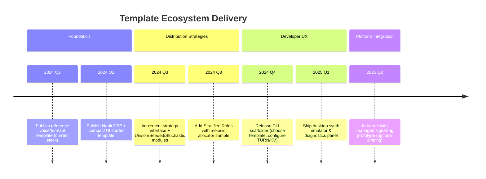
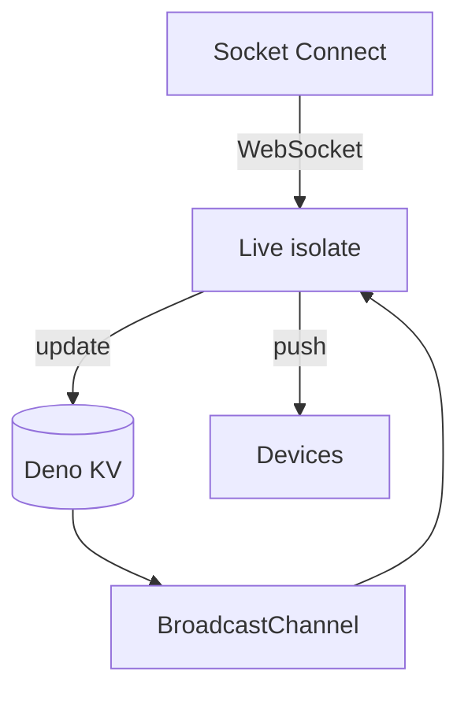

# Templates Roadmap

This document tracks the plan for delivering opinionated-yet-extensible templates that lower the barrier for creative coders and sonic artists to adopt distributed synthesis. The emphasis is on a reliable, Deno Deploy-compatible networking layer paired with swappable DSP and UI modules.

## Guiding Principles

1. **Networking Opinionated, Creativity Agnostic**
   - Lock in WebRTC/SFU signalling (edge-hosted via Deno Deploy + KV).
   - Maintain staged/live state semantics, HRG/RBG distribution contracts, and minimal-computation philosophy.
   - Leave DSP worklets and control surfaces pluggable via a small API.

2. **Distribution Modes as First-class Concepts**
   - Support multiple ensemble behaviours out of the box: Unison, Stratified Roles, Seeded Deterministic, Free Stochastic, Reactive (scaffold).
   - Expose a `DistributionStrategy` interface so advanced users can write custom strategies without touching transport code.

3. **DX & Deployment Friendly**
   - Provide CLI scaffolding, emulator tooling, and documentation so newcomers can ship a performance-ready ensemble in hours.
   - Target Deno Deploy for signalling to deliver an edge-capable, minimal-infrastructure experience.

## Delivery Timeline



## Template Variants

| Template | Purpose | DSP | Control UI | Distribution Mode | Notes |
|----------|---------|-----|------------|-------------------|-------|
| `voice-reference` | Show complete working ensemble (current voice.worklet) | Voice formant/zing | Compact HRG UI | Configurable (default stochastic) | Best-practice example, well-commented |
| `blank-dsp` | Starting point for custom DSP | Stub worklet logging values | Compact UI | Configurable | Minimal code footprint |
| `headless-control` | For external controllers (Max/MSP, MIDI) | None (external) | Minimal status UI | Configurable | Focus on message schema & signalling only |
| `keys` | Keyboard-style meiosis allocator with Web MIDI + ADSR | Sine-voice worklet (replaceable) | MIDI control UI | Seeded/Role-based | Showcases dx7-like polyphony
| Future: `granular`, `sampler` | Showcase additional engines | Granular / Sample replay | Optional alt UI | Configurable | Released after foundation | | Showcase additional engines | Granular / Sample replay | Optional alt UI | Configurable | Released after foundation |

## Distribution Strategy Interface

```ts
export interface DistributionStrategy {
  onSynthJoin(peerId: string): RoleSeed;
  onSynthLeave(peerId: string): void;
  onProgramUpdate(program: ProgramConfig): void;
  nextValues(peerId: string, generators: Generators): ResolvedValues;
}
```

Strategy implementations provided by default:
- `UnisonStrategy` – identical values.
- `SeededStrategy` – deterministic mapping from device seed (sorting by join order, etc.).
- `StratifiedRolesStrategy` – dynamic role allocator (meiosis-style note distribution).
- `FreeStochasticStrategy` – per-synth randomness (current behaviour).
- `ReactiveStrategy` – scaffold for future feedback-based systems.

## Control-side Affordances

- **Mode Selector**: toggle strategy at runtime; updates persisted in `stagedState`.
- **Role Editor** (when applicable): view/edit roles, voice allotments, manual pinning.
- **Seed Controls**: buttons to reshuffle seeds, choose seed source (peer ID hash, scene slot).
- **Diagnostics Overlay**: shows active roles, seed assignments, per-device counts (useful for rehearsals).

## Synth-side Affordances

- Role/seed indicator overlay (toggleable) for artists to understand device contribution.
- Dev-only debug HUD (resolved indices, envelope values) available via query flag.
- Strategy-specific hooks (e.g., stratified roles can expose more nuanced panning/detune).

## Deno Deploy Signalling Plan



- **Runtime**: `Deno.serve` with `upgradeWebSocket` for ctrl/synth connections.
- **State**: Deno KV stores presence maps, program snapshots, scene metadata (TTL-based for auto cleanup).
- **Cross-isolate fanout**: `BroadcastChannel` invalidates caches across isolates after KV writes.
- **Templates**: include Deploy config (`deno.json` and `deployctl` scripts) so users can deploy signalling + static assets with one command.

## Developer Experience Enhancements

1. **CLI (`create-distributed-synth`)**
   - Prompts for template choice, distribution strategy, TURN credentials.
   - Optionally provisions a Deno Deploy project (via API) and outputs deploy instructions.
2. **Desktop Emulator**
   - Electron/Deno GUI simulating multiple synth clients, showing role/seed assignments, resolved parameters.
3. **Integration Guides**
   - Short docs showing how to hook the bus from SuperCollider, Max/MSP, TouchDesigner, etc.
4. **Recipes & Tests**
   - Automated integration test that spins up signalling, spawns simulated synths, switches distribution strategies, and verifies assignments.

## Open Questions

- **Module Packaging**: Should DSP/strategy modules be published as ESM packages (`npm:` importable) or kept local within templates? (Leaning towards local with optional npm publishing.)
- **Telemetry Opt-in**: For future reactive strategies, define minimal telemetry events without violating the “controller blindedness” philosophy.
- **Granular Roles**: Design UX for controlling voice counts per note/role when using dynamic allocators.

## Next Steps

- Finalise strategy interface and seed initial implementation (2024 Q2).
- Convert existing repo into `voice-reference` template; extract blank-dsp variant.
- Scaffold Deno Deploy config and KV schema (presence, program, scenes).
- Draft CLI spec and emulator requirements (Q3 kickoff).

---

This plan will be revisited alongside the main project roadmap to ensure templates evolve with distribution strategies, platform tooling, and protocol decisions.
